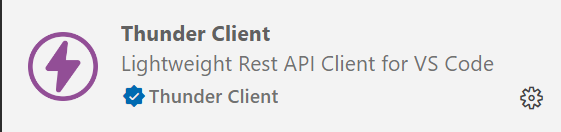
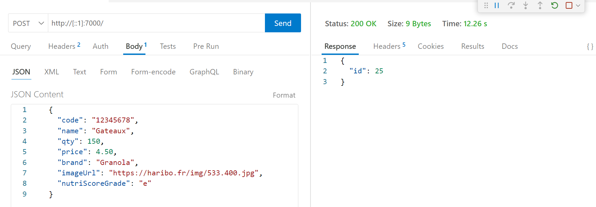

# Exercice 8 : API REST avec Express

## Modalités

- Effectuez vos tests via l'extension Visual Studio Code **`ThunderClient`** dans un premier, le lien entre le front et le back-end pourra être effectué plus tard.

---

## Enoncé

1. Créez un nouveau projet Express
2. Construisez une API REST avec Express pour les news depuis le fichier [news.json](../0-exercices/corrections/ex7/public/data/news.json) de l'exercice 7

---

## Aide création d'une API REST

1. Définissez 
- vos routes
- vos méthodes HTTP
- vos opérations CRUD

2. Associez la combinaison de vos routes, méthodes et opérations à des réponses au format JSON à retourner au client qui effectue une requête avec les paramètres précédents
3. Gérez le cas d'erreurs
- mauvaise méthode
- mauvaise opération
- mauvaise route
- donnée fourni manquante ou incorrecte
4. Effectuez vos tests avec l'extension ThunderClient de VSCODE
5. Dans un README.md, ajoutez le minimum de documentation montrant l'utilisation de votre API

### Exemple d'une requête avec ThunderClient

